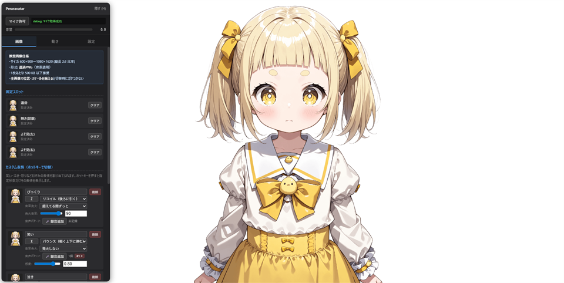

# Peraravatar

ブラウザだけで動く軽量 PNGTuber（バーチャル顔出し）ツール。マイク音量に反応した口パク・自動瞬き・カスタム表情切替・OBS連携などが全て1ファイルで完結します。



## 🚀 Try it now

セットアップなしでブラウザから直接お試しできます：

**👉 https://ichigyun.github.io/peraravatar/**

初回はマイク許可ダイアログが出ます。「画像」タブで自分のアバター画像を差し替えてください。設定はブラウザ内に自動保存されます。

> 配信用途で使う場合は、安定動作のためローカルサーバー起動を推奨します（下記「クイックスタート」参照）。

## 機能

- マイク音量に応じた口パク（段階数・閾値・各段階画像数すべて自由）
- 自動瞬き／呼吸／左右揺れ／首かしげ／視線揺れ／ねむい状態
- カスタム表情切替（ホットキー or 音量で発火、動作は8種類から選択）
- アイドル時のよそ見（左右画像対応）
- 透過確認用の背景色／チェッカー柄表示
- 設定は localStorage + IndexedDB に自動保存、JSON 書き出し/読み込み対応

---

## クイックスタート

### 1. ローカルサーバーを起動する

`getUserMedia`（マイクアクセス）は `file://` で動かないため、ローカル HTTP サーバー経由で開く必要があります。

| 方法 | bat | 前提 |
|---|---|---|
| Python | `server-python.bat` | Python が必要 |
| Node.js | `server-node.bat` | Node.js が必要 |

どちらか一方が入ってればOK。bat はコマンドプロンプトが開いたままになります（**閉じるとサーバーも止まります**）。

### 2. ブラウザで開く

```
http://localhost:8765/
```

### 3. 自分の画像を設定する

「画像」タブで各スロット（通常 / 瞬き / よそ見 左右 / カスタム表情 / 口パク各段階）に画像を差し替えてください。

推奨画像仕様（パネル上部にも表示）：
- サイズ: **600×900〜1080×1620**（縦長 2:3 比率）
- 形式: **透過 PNG**
- 1枚あたり: **500 KB 以下推奨**
- 全画像で**位置・スケールを揃える**と切替時にガタつかない

### 4. OBS への組み込み

OBS Studio で「ブラウザソース」を追加：

- URL: `http://localhost:8765/`
- 幅 × 高さ: 画像のアスペクト比に合わせる（例: 600×900）
- 「ローカルファイル」: チェックしない

**ブラウザソースでマイクを使うための重要設定**: OBS のショートカット（デスクトップ等）を右クリック → プロパティ → 「リンク先」を次のように編集してください：

```
"C:\Program Files\obs-studio\bin\64bit\obs64.exe" --use-fake-ui-for-media-stream --autoplay-policy=no-user-gesture-required
```

「作業フォルダー」が空の場合は `C:\Program Files\obs-studio\bin\64bit` を設定。このフラグがないと、ブラウザソースのマイク許可が永遠に降りません。

### 5. 配信用にパネルを隠す

「設定」タブの「**OBS用に起動時パネル非表示**」にチェック → 次回読み込み時にパネル自動非表示。再表示は **H キー** で可能。

または URL に `?panel=0` で強制非表示。

---

## Python / Node.js のインストール

どちらか一方で OK。

### Python（推奨：簡単）

公式: <https://www.python.org/downloads/>

1. Windows installer をダウンロード
2. **「Add Python to PATH」にチェック** → 「Install Now」
3. `python --version` が動けば OK

### Node.js

公式: <https://nodejs.org/>

1. LTS 版インストーラをダウンロード
2. デフォルト設定でインストール（PATH 設定はチェック済）
3. `node --version` / `npx --version` が動けば OK

---

## 使い方

### 画像タブ

**固定スロット**: 通常 / 瞬き(閉眼) / よそ見(左) / よそ見(右)
- スロットをクリックで画像ファイル選択
- よそ見は片方だけでもOK（両方あればランダム）

**カスタム表情**:
- 「+ 表情を追加」でいくつでも追加可能
- 各表情に設定できる項目:
  - 名前（任意）
  - 画像（クリックで選択）
  - **ホットキー**: ボタンを押して任意のキーを割り当て
  - **動作**: 動かない / ホップ / リコイル / 震える / バウンス / ゆらゆら / うなずく / 首を振る
  - **音量発火**: OFF / 超えた瞬間に一度だけ（1秒） / 超えてる間ずっと
  - **発火閾値**: 音量がこの値を超えると発火（0〜100）
  - **音声パターン**: 笑い声/泣き声などの2秒間の音量変化を録音 → 似た波形を検出して自動発火（β機能、誤発火する場合は感度を下げる）
- ホットキーは押している間だけ表示。複数表情で同じキーを割り当てた場合、後で割り当てた方が優先（旧割当は自動で外れる）

### 音声パターン発火の仕組み

「🎤 録音追加」ボタンで2.5秒間の音量波形を記録します。3秒カウントダウン後に録音が始まるので、その間に「えへへへへ」と笑うなどの音声を出してください。記録後、似た音量変化のパターンを検出するとその表情が自動で1秒間表示されます。

- **複数登録可**: 同じ表情に複数のパターンを録音できます（「えーん」「ぐすっぐすっ」「うー…」など別パターンを1つの泣き表情に登録）。どれか1つでもマッチすれば発火
- **感度**: 0.3〜0.95。高いほど厳密、低いほどゆるく検出
- 完全な音声認識ではなく**音量波形のパターンマッチ**なので、リズムや抑揚が違うと検出されません
- 相関だけでなく**ピーク数**も照合するので、笑い（多ピーク）と泣き（少ピーク）は判別しやすい

### ⚠️ 運用上の注意

#### 検知遅延について
音声パターン検知は **波形を2.5秒分溜めてから判定する**仕組みのため、笑い終わった・泣き終わった**直後**にアバターの表情が変わります（リアルタイム検知ではありません）。

**回避策**: OBS の **「音声詳細プロパティ」→「同期オフセット」** で自分の声やゲーム音声に **+1500ms** 程度の遅延を入れると、視聴者には「音声と表情がズレずに同期している」ように見えます。

#### 同時複数発火のリスク
複数の表情に音声パターンを設定すると、似た音量パターンで意図しない表情が発火することがあります。**パターン発火を設定する表情は1つだけ**にしておくと事故が少ないです（例: 「びっくり」と「笑い」は音量発火のみ、「泣き」だけ音声パターンを設定）。

#### ホットキーが最も確実
音声パターン検知は補助的な機能と考え、確実にこの表情を出したい場面では**ホットキー併用**がおすすめです。

**口パク（音量ごとの段階）**:
- 「無音とみなす上限」以下は完全に閉じ
- 段階を「+ 口パク段階を追加」で増減可能
- 各段階に閾値と画像（複数可、複数枚は350msごとにランダム切替）
- 音量がその段階の閾値を超えると、その段階の画像から1枚表示

### 動きタブ

呼吸/揺れ／瞬き／しゃべり中の首かしげ／アイドル時の視線揺れ／大声時のリアクション／よそ見／おねむ状態／カスタム表情の動作、全てスライダーまたは数値入力でリアルタイム調整可能。時間系は秒表示。

「おねむ状態」: 無音が続くと徐々に瞬きが長くなり、完全就寝時刻を超えると目を閉じっぱなしになる演出。話し始めれば即座に解除。

### 設定タブ

- **背景（透過確認用）**: 透明 / チェッカー柄 / 単色から選択
- **OBSモード**: 起動時パネル非表示
- **デフォルトに戻す**: 全設定 + 画像リセット
- **JSONで書き出し**: 設定全体（画像 dataURL 含む）を1ファイル保存
- **JSONを読み込み**: 別環境からの取り込み

---

## ホットキー

| キー | 動作 |
|---|---|
| Z, X, C, V… | カスタム表情（画像タブで自由に変更可、自動順番割当） |
| H | パネル開閉 |
| Y | よそ見を強制発火（左右ランダム） |
| Escape | ホットキー割当キャプチャ中のキャンセル |

> OBS のブラウザソース上ではキーボード入力が直接届かないため、OBS のホットキー設定や「インタラクト」モード経由でないと反応しません。

---

## URL パラメータ

| パラメータ | 動作 |
|---|---|
| `?custom=z` | KeyZ に割り当てた表情を固定表示（パネルも自動非表示） |
| `?custom=笑い` | ラベル名で指定 |
| `?custom=<id>` | 表情 ID 直接指定 |
| `?panel=0` | パネルを強制非表示 |

---

## OBS 配信中のカスタム表情手動切り替え

配信中にゲームに集中してて声で発火させづらい場面や、確実に特定の表情を出したい場合は、**シーンを切り替えて表情固定**するのが確実です。

### セットアップ手順

1. **メインシーン（自動制御）**を作る
   - ブラウザソースを追加し URL に `http://localhost:8765/` を設定
   - これは音量・パターンで自動的に表情が切り替わる通常モード

2. **表情固定シーン**を表情ごとに作る
   - 例: シーン「驚き顔」を作る
   - ブラウザソースを追加、URL に `http://localhost:8765/?custom=z` を指定
     - `?custom=z` の z は「びっくり」表情に割り当てたキー
     - 同様に `?custom=x` は笑い、`?custom=c` は泣き
   - 同じ要領で「笑顔シーン」「泣き顔シーン」を作る

3. **OBS のホットキーを割り当て**
   - 設定 →「ホットキー」を開く
   - 「驚き顔」シーンの「現在のシーンに切り替え」に **F1** を割り当て
   - 「笑顔」シーンを **F2**、「泣き顔」を **F3** など、好きなキーに
   - 「メインシーン」に戻すキーも忘れずに（例: F4）

4. **配信中の操作**
   - 普段はメインシーン（自動制御）
   - びっくりさせたい瞬間に F1 → 驚き顔シーンに切り替え → 表情固定
   - F4 でメインに戻す

### 補足

- 表情固定シーン側は `?custom=...` 付きの URL を使うので、ブラウザソースのパネルは自動で非表示・マイクは不要（無音検出されないので顔が動かない＝固定表示）
- スタジオモードを使うと「プレビュー」で確認してから「トランジション」で本番側に反映できる
- シーン切替ではなく**ソースの表示・非表示**でも同じことが可能。1つのシーン内に複数ブラウザソースを重ねて、表示中のものだけ見える運用

---

## デフォルトのカスタム表情

| 表情 | キー | 動作 | 音量発火 |
|---|---|---|---|
| びっくり | Z | リコイル | ホールド (90以上) |
| 笑い | X | バウンス | OFF |
| 泣き | C | 震える | OFF |

---

## 設定の保存場所

- 軽量設定（閾値・モーション値等）: **localStorage**
- 画像データ: **IndexedDB**（容量大、通常50MB〜）

オリジン毎に分離されるので、`http://localhost:8765` で設定したものと OBS のブラウザソース内設定は別物です。**OBS のブラウザソースで開いて設定する**のが基本。

引き継ぐ時は「JSONで書き出し」→ 別環境で「JSONを読み込み」。画像も含めて1ファイルで丸ごと移動できます。

---

## トラブルシューティング

### マイク許可が降りない

- **OBS ブラウザソース**: 起動フラグ `--use-fake-ui-for-media-stream` 必須
- **Chrome/Edge 通常ブラウザ**: アドレスバー左の鍵アイコン → マイク許可
- **debug 欄に `NotAllowedError`**: 上記いずれかで対処
- **debug 欄に `protocol=file:`**: `file://` で開いてる → サーバー経由（`http://localhost`）で開き直す

### IndexedDB 容量超過エラー

debug 欄に「ストレージ容量超過」と出た場合：
- 既存の画像をいくつか削除
- 「JSONで書き出し」でバックアップ → 「デフォルトに戻す」でリセット
- 登録する画像のファイルサイズを小さくする（PNG縮小・JPEG化など）

### 設定が消える

- ブラウザのキャッシュ全削除や、シークレットモードでは保存されません
- 引き継ぐなら JSON 経由で

### アバターが表示されない

- 「画像」タブの「通常」スロットに画像が設定されているか確認
- debug 欄でエラーを確認

### OBS でアバターのサイズが合わない

- OBS 側のブラウザソースの「幅」「高さ」を画像のアスペクト比に合わせる
- シーン内で右クリック →「変換」→「画面に合わせる」など

---

## ライセンス

MIT License
